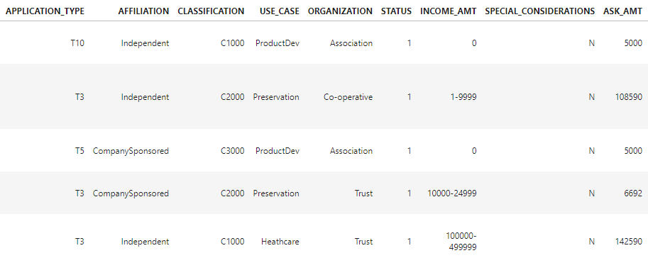
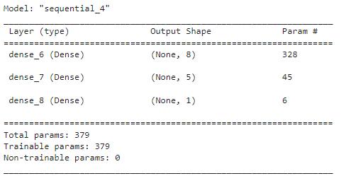
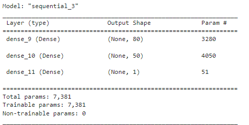
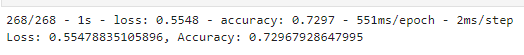

# Neural Network Charity Analysis

## Purpose
Utilizing knowledge of machine learning and neural networks, a binary classifier was created using a provided dataset to predict the success of applicants.
## Results

### Data Preprocessing

#### •	target variable : IS_SUCCESSFUL
#### •	features:

#### •	variables that were removed: EIN and NAME

### Compiling, Training, and Evaluating the Model

#### • neurons: 131, layers: 3, activation functions: 3 the large number of neurons and layers was chosen to allow the model more opportunities to find trends in the data set

#### • Target model performance was not achieved, it was below the accuracy percentage target: 75%

#### • The number of neurons and activation functions were altered to try and increase model performance

## Summary
The overall results for the deep learning model were comparatively similar before and after optimization. The accuracy of the model would reach approximately 73% which is below the desired percentage. With such a large dataset, it would not be advisable to use a logistic regression to evaluate the data. However, it may be possible to use support vector machines (SVMs). SVMs require less to build and train and work similarly to deep learning models, but they are less prone to overfitting.
